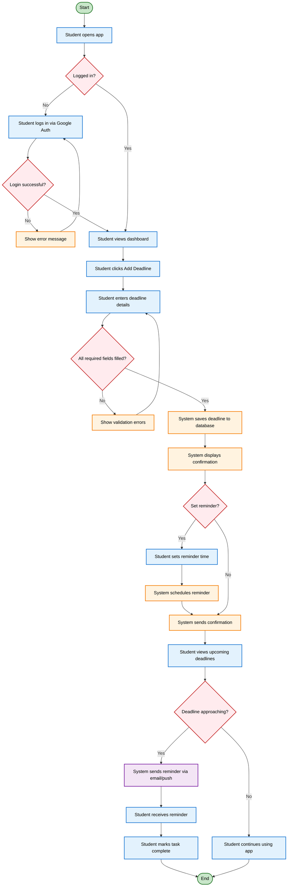

# UML Activity Diagram — Academic Deadline Tracker

**Diagram Type:** UML Activity Diagram (with swimlanes)  
**Scope:** Core workflow — Student adds a deadline and receives a reminder  
**Audience:** Business analysts, developers  
**Risk Reduced:** Process gaps and unclear responsibilities  

**Swimlane Legend:**

| Swimlane | Nodes | Responsibility |
|----------|-------|----------------|
| **Student** | A, C, F, G, H, N, Q, T, U, V | All user actions and decisions |
| **System** | B, D, E, I, J, K, L, M, O, P, R | All automated processing and validation |
| **External Services** | S (Email/Push) | Third-party notification delivery |

**Key:**
- **Green ovals** = Start / End nodes
- **Red diamonds** = Decision nodes with guards (labelled on every outgoing arrow)
- **Blue rectangles** = Student actions
- **Orange rectangles** = System actions
- **Purple rectangles** = External service actions

**Owner:** Princess Mae G. Morata  
**Reviewer:** Vanessa Jhane G. Guda
