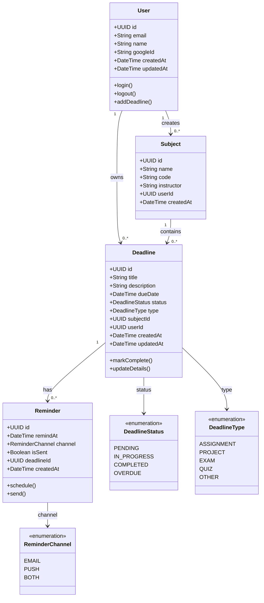

# UML Class Diagram — Academic Deadline Tracker

**Diagram Type:** UML Class Diagram  
**Scope:** 7 domain classes with typed attributes, multiplicities, and status enumerations  
**Audience:** Developers, database designers  
**Risk Reduced:** Data model inconsistencies and missing relationships  

**Key:**
- **Multiplicity** shown at both ends of each association (1, 0..*, etc.)
- **Enumeration** for every status field (`DeadlineStatus`, `DeadlineType`, `ReminderChannel`)
- **Typed attributes** with visibility (`+` = public)
- **Methods** shown in parentheses

**Relationship Summary:**

| Relationship | Meaning |
|--------------|---------|
| User → Subject | One user creates many subjects |
| User → Deadline | One user owns many deadlines |
| Subject → Deadline | One subject contains many deadlines |
| Deadline → Reminder | One deadline has many reminders |

**Owner:** Shamel Joy G. Fugio  
**Reviewer:** Vanessa Jhane G. Guda
