# UML Component Diagram — Academic Deadline Tracker

**Diagram Type:** UML Component Diagram  
**Scope:** API container components, provided interfaces, required interfaces  
**Audience:** Developers, integration testers  
**Risk Reduced:** Missing interfaces and tight coupling  

```mermaid
flowchart TB
    classDef component fill:#E3F2FD,stroke:#1976D2,color:#000,stroke-width:2px
    classDef provided fill:#C8E6C9,stroke:#2E7D32,color:#000,stroke-width:2px
    classDef required fill:#FFCCBC,stroke:#D84315,color:#000,stroke-width:2px

    subgraph API["API Container (Express)"]
        AuthComp["Auth Component"]:::component
        DeadlineComp["Deadline Component"]:::component
        ReminderComp["Reminder Component"]:::component
        SubjectComp["Subject Component"]:::component
        UserComp["User Component"]:::component
    end

    subgraph Provided["Provided Interfaces"]
        IAuth["IAuth"]:::provided
        IDeadline["IDeadline"]:::provided
        IReminder["IReminder"]:::provided
        ISubject["ISubject"]:::provided
        IUser["IUser"]:::provided
    end

    subgraph Required["Required Interfaces"]
        RDB["IDatabase"]:::required
        REmail["IEmailService"]:::required
        RPush["IPushService"]:::required
        RGoogle["IGoogleAuth"]:::required
    end

    AuthComp --> IAuth
    AuthComp --> RGoogle
    AuthComp --> RDB

    DeadlineComp --> IDeadline
    DeadlineComp --> RDB
    DeadlineComp --> REmail
    DeadlineComp --> RPush

    ReminderComp --> IReminder
    ReminderComp --> RDB
    ReminderComp --> REmail
    ReminderComp --> RPush

    SubjectComp --> ISubject
    SubjectComp --> RDB

    UserComp --> IUser
    UserComp --> RDB
```

**Key:**
- **Blue boxes** = Components inside the API
- **Green boxes** = Provided interfaces (what each component offers)
- **Red boxes** = Required interfaces (what each component needs)
- **Arrows** = Dependency direction

**Interface Purpose:**

| Interface | Type | Purpose |
|-----------|------|---------|
| IAuth | Provided | Authentication operations |
| IDeadline | Provided | Deadline CRUD operations |
| IReminder | Provided | Reminder scheduling |
| ISubject | Provided | Subject CRUD operations |
| IUser | Provided | User profile operations |
| IDatabase | Required | Database access |
| IEmailService | Required | Email delivery |
| IPushService | Required | Push notification delivery |
| IGoogleAuth | Required | Google OAuth validation |

**Owner:** Vanessa Jhane G. Guda  
**Reviewer:** Princess Mae G. Morata
