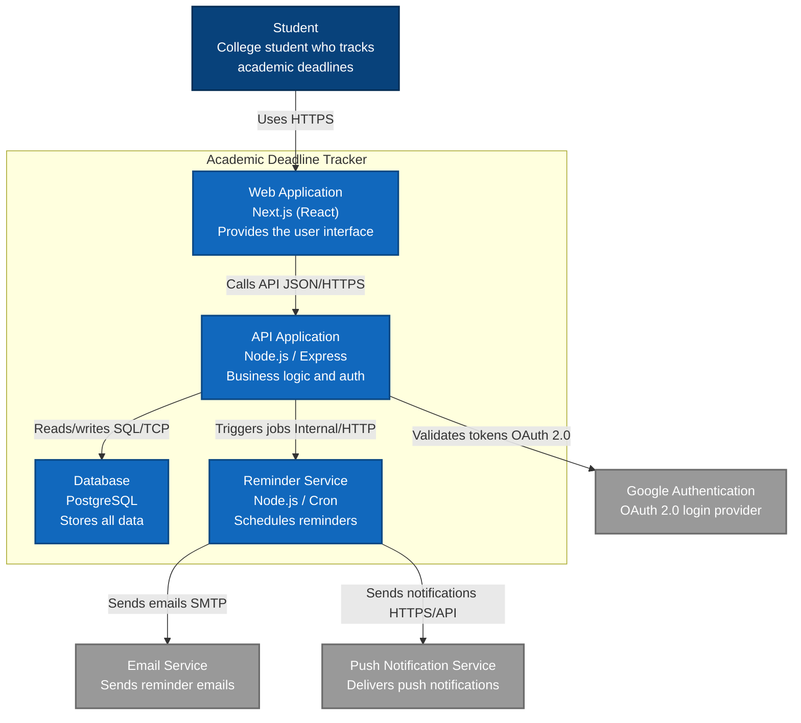

# C4 Container Diagram — Academic Deadline Tracker

**Diagram Type:** C4 Level 2 — Container  
**Scope:** Every separately deployable unit inside the Academic Deadline Tracker  
**Audience:** Development team, technical stakeholders  
**Risk Reduced:** Technology mismatch and deployment confusion  

**Key:**
- **Blue boxes inside boundary** = Containers (separately deployable units)
- **Database box** = Data store
- **Gray boxes** = External systems
- **Arrows** = Labelled with intent and protocol

**Statement:** The Next.js app is drawn as **one container** because we use Next.js as a single full-stack application with API routes, not a separate frontend/backend split.

**Owner:** Vanessa Jhane G. Guda  
**Reviewer:** Shamel Joy G. Fugio
