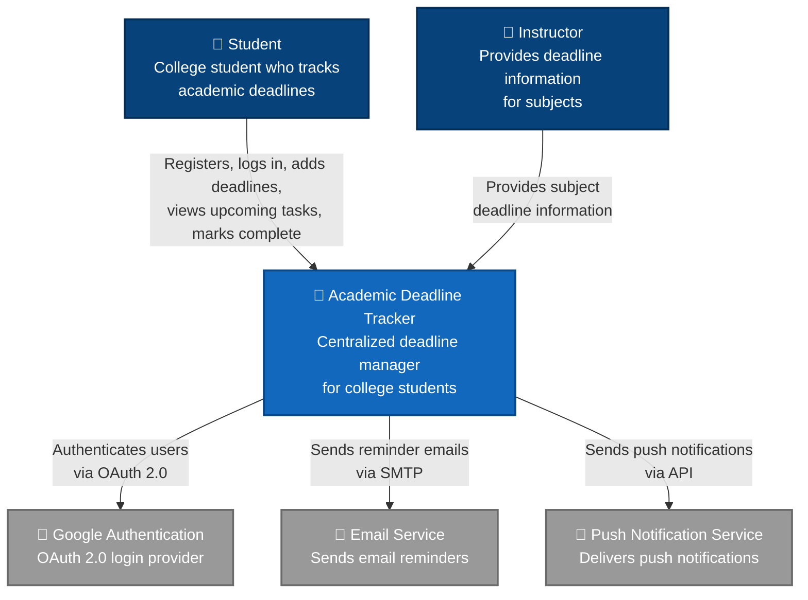

# C4 System Context Diagram — Academic Deadline Tracker

**Diagram Type:** C4 Level 1 — System Context  
**Scope:** The Academic Deadline Tracker as a single system, all user roles, and all external systems  
**Audience:** All stakeholders  
**Risk Reduced:** Scope creep and missing external dependencies  

**Key:**
- **Blue box** = Your MVP (one box)
- **Dark blue boxes** = Human user roles
- **Gray boxes** = External systems your MVP depends on
- **Arrows** = Labelled with what each actor/system is trying to do

**Owner:** Vanessa Jhane G. Guda  
**Reviewer:** Princess Mae G. Morata
