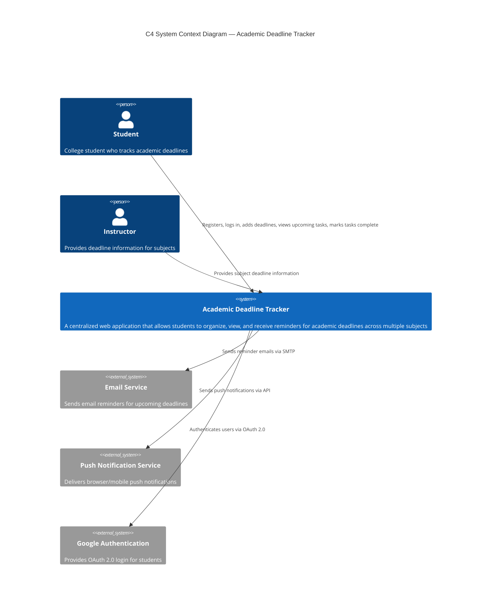

# C4 System Context Diagram — Academic Deadline Tracker

**Diagram Type:** C4 Level 1 — System Context  
**Scope:** The Academic Deadline Tracker as a single system, all user roles, and all external systems  
**Audience:** All stakeholders  
**Risk Reduced:** Scope creep and missing external dependencies  

**Key:**
- **Person** = Human user role
- **System** = Your MVP (one box)
- **System_Ext** = External system your MVP depends on
- **Rel** = Labelled relationship showing intent

**Owner:** Vanessa Jhane G. Guda  
**Reviewer:** Princess Mae G. Morata
