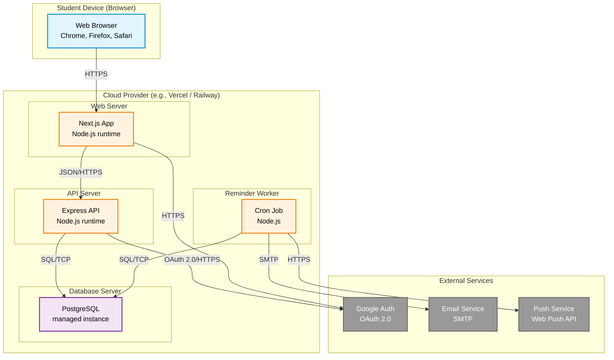

# Provisional UML Deployment Diagram — Academic Deadline Tracker

**Diagram Type:** UML Deployment Diagram  
**Scope:** Hosting infrastructure — nodes, execution environments, artifacts  
**Audience:** DevOps, system administrators  
**Risk Reduced:** Deployment misconfiguration and missing infrastructure  

> **Title:** Provisional — provider names are generic until hosting is finalized.

**Key:**
- **Blue box** = User device (browser)
- **Purple box** = Cloud infrastructure boundary
- **Orange boxes** = Deployable artifacts (Next.js, Express, Cron)
- **Gray boxes** = External services
- **Arrows** = Labelled with protocol on every path

**Deployment Notes:**

| Node | Artifact | Technology |
|------|----------|------------|
| Web Server | Next.js App | Node.js runtime |
| API Server | Express API | Node.js runtime |
| Reminder Worker | Cron Job | Node.js |
| Database Server | PostgreSQL | Managed instance |

**Protocols Used:** HTTPS, JSON/HTTPS, SQL/TCP, SMTP, OAuth 2.0/HTTPS

**No secrets or real addresses are shown.**

**Owner:** Princess Mae G. Morata  
**Reviewer:** Shamel Joy G. Fugio
