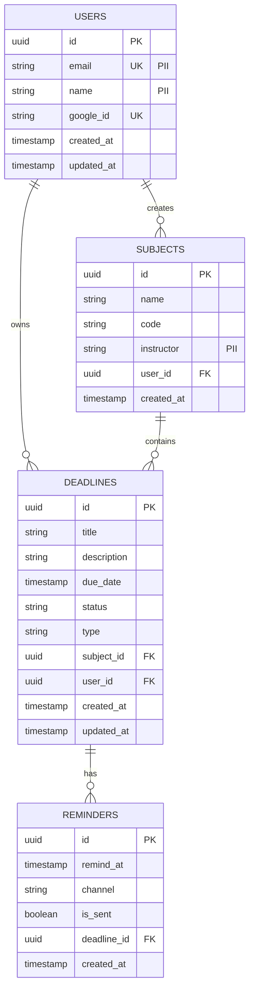

# Draft Entity Relationship Diagram — Academic Deadline Tracker

**Diagram Type:** Draft ERD  
**Scope:** One table per stored class, primary/foreign keys, crow's-foot cardinality, PII marked  
**Audience:** Database designers, backend developers  
**Risk Reduced:** Data integrity issues and missing foreign keys  

**Key:**
- **PK** = Primary Key
- **FK** = Foreign Key
- **UK** = Unique Key
- **PII** = Personally Identifiable Information (marked in quotes)
- **Crow's-foot notation:**
  - `||--o{` means **one-to-zero-or-many**
  - `||` = exactly one
  - `o{` = zero or many

**PII Columns Marked:**
- `USERS.email` — PII
- `USERS.name` — PII
- `SUBJECTS.instructor` — PII

**Cardinality Rules:**

| Relationship | Meaning |
|--------------|---------|
| USERS → SUBJECTS | One user can create zero or many subjects |
| USERS → DEADLINES | One user can own zero or many deadlines |
| SUBJECTS → DEADLINES | One subject can contain zero or many deadlines |
| DEADLINES → REMINDERS | One deadline can have zero or many reminders |

**Cross-View Consistency:**
- Table names match class names from `class.md` (User → USERS, Subject → SUBJECTS, Deadline → DEADLINES, Reminder → REMINDERS)
- Cardinalities match multiplicities from `class.md` (1 → 0..*)
- Status and type columns match enumerations from `class.md`

**Owner:** Shamel Joy G. Fugio  
**Reviewer:** Wenly M. Caalam
