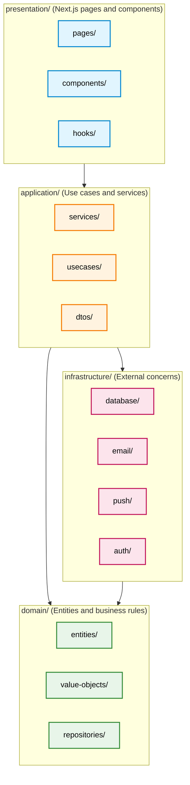

# UML Package Diagram — Academic Deadline Tracker

**Diagram Type:** UML Package Diagram  
**Scope:** Folder structure for the codebase with dependency arrows  
**Audience:** Developers, architects  
**Risk Reduced:** Circular dependencies and layering violations  

**Key:**
- **Blue boxes** = Presentation layer (UI)
- **Orange boxes** = Application layer (use cases)
- **Green boxes** = Domain layer (business rules)
- **Pink boxes** = Infrastructure layer (external services)
- **Arrows** = Direction of dependency (who imports whom)

**Layering Rule (one sentence):**

> Presentation never imports Infrastructure directly; all external services are accessed through Application services and Domain repository interfaces.

**Owner:** Wenly M. Caalam  
**Reviewer:** Shamel Joy G. Fugio
