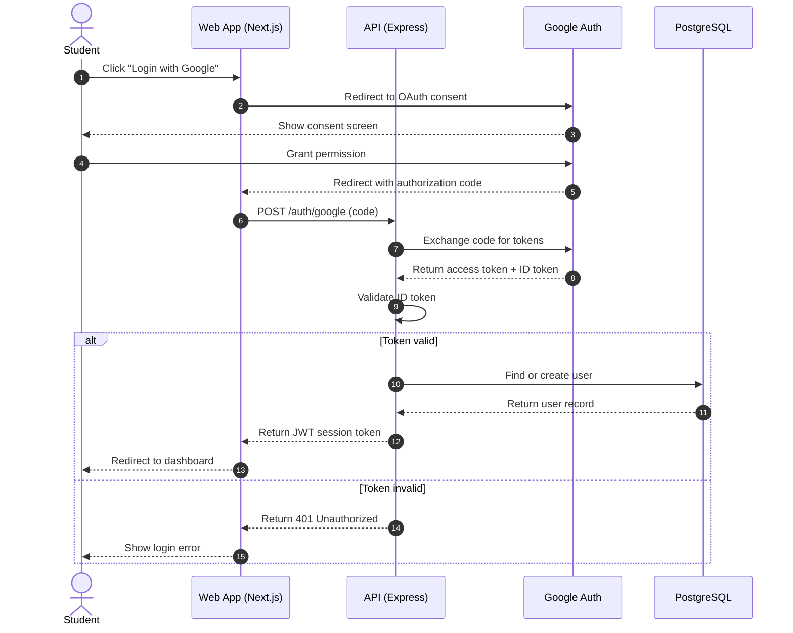

# UML Sequence Diagram — Academic Deadline Tracker

**Diagram Type:** UML Sequence Diagram  
**Scope:** Riskiest flow — Login via Google Auth (external system + security)  
**Audience:** Developers, security reviewers  
**Risk Reduced:** Authentication failures and security vulnerabilities  

**Key:**
- **Solid arrow (→)** = Synchronous message
- **Dashed arrow (-->>)** = Reply / Return message
- **alt / else** = Alternative flow (branch)
- **Lifelines** = Student, Web App, API, Google Auth, PostgreSQL

**Why this is the riskiest flow:** It involves an external system (Google), security tokens, database writes, and session management. A failure here blocks all other features.

**Owner:** Shamel Joy G. Fugio  
**Reviewer:** Wenly M. Caalam
