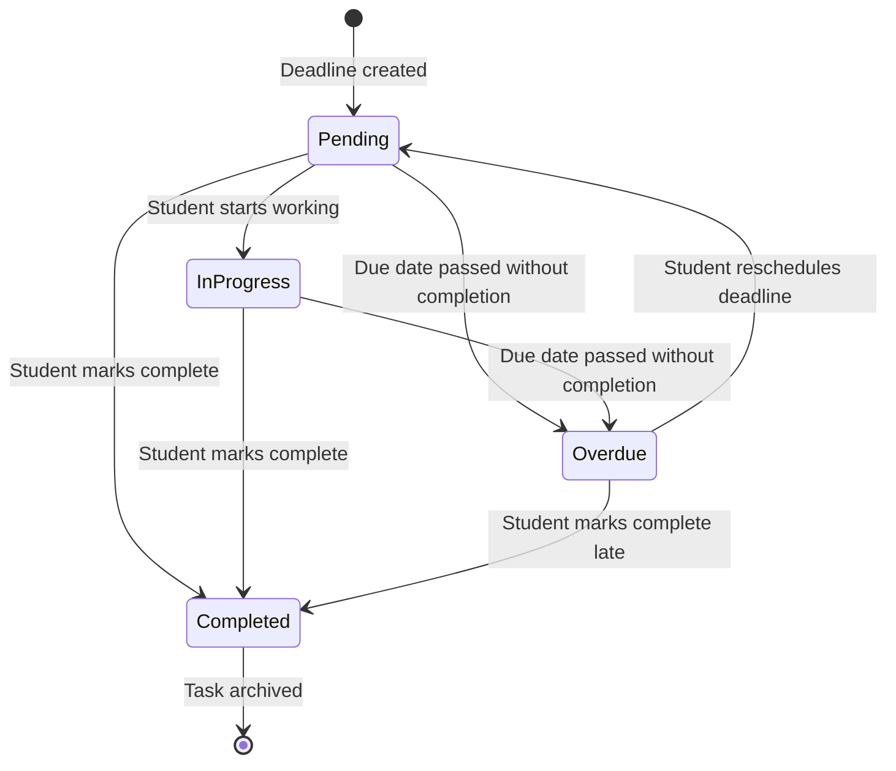

# UML State Machine Diagram — Academic Deadline Tracker

**Diagram Type:** UML State Machine Diagram  
**Scope:** Deadline entity lifecycle (the main entity with a status field)  
**Audience:** Developers, QA team  
**Risk Reduced:** Invalid state transitions and missing status handling  

**Key:**
- **States** named as conditions: Pending, InProgress, Overdue, Completed
- **Transitions** labelled with triggering events
- **Initial state** = `[*]` → Pending
- **Final state** = Completed → `[*]`

**Status Enumeration Match:** `PENDING`, `IN_PROGRESS`, `COMPLETED`, `OVERDUE` — exactly matches the `DeadlineStatus` enumeration in the class diagram (`class.md`).

**State Meanings:**

| State | Meaning |
|-------|---------|
| Pending | Deadline created but not yet started |
| InProgress | Student has begun working on it |
| Overdue | Due date passed without completion |
| Completed | Student marked it done |

**Owner:** Wenly M. Caalam  
**Reviewer:** Princess Mae G. Morata
