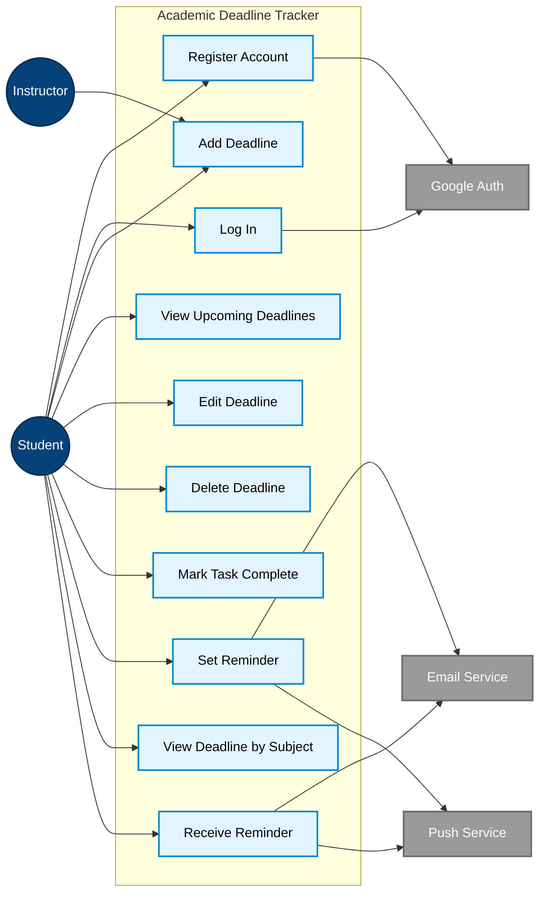

# UML Use Case Diagram — Academic Deadline Tracker

**Diagram Type:** UML Use Case Diagram  
**Scope:** Every actor from the context diagram and 10 goal-level use cases from the MVP feature list  
**Audience:** Product owner, QA team  
**Risk Reduced:** Missing user goals and scope misalignment  

**Key:**
- **Dark blue circles** = Actors (users or external systems)
- **Light blue boxes** = Use cases (goal-level features, named verb + object)
- **Gray boxes** = External systems
- **Arrows** = Association between actor and use case

**Use Case → MVP Feature Mapping:**

| # | Use Case | MVP Feature |
|---|----------|-------------|
| 1 | Register Account | Login with Google |
| 2 | Log In | Login with Google |
| 3 | Add Deadline | Add deadline |
| 4 | View Upcoming Deadlines | View deadlines |
| 5 | Edit Deadline | Edit deadline |
| 6 | Delete Deadline | Delete deadline |
| 7 | Mark Task Complete | Mark complete |
| 8 | Set Reminder | Set reminder |
| 9 | View Deadline by Subject | Organize by subject |
| 10 | Receive Reminder | Receive reminder |

**Owner:** Princess Mae G. Morata  
**Reviewer:** Wenly M. Caalam
